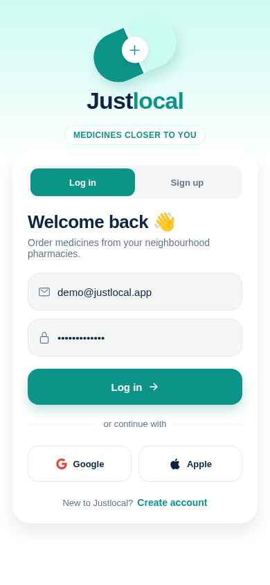
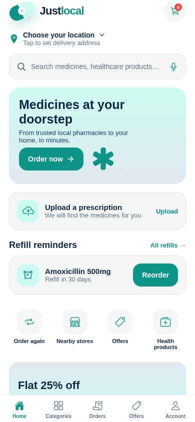
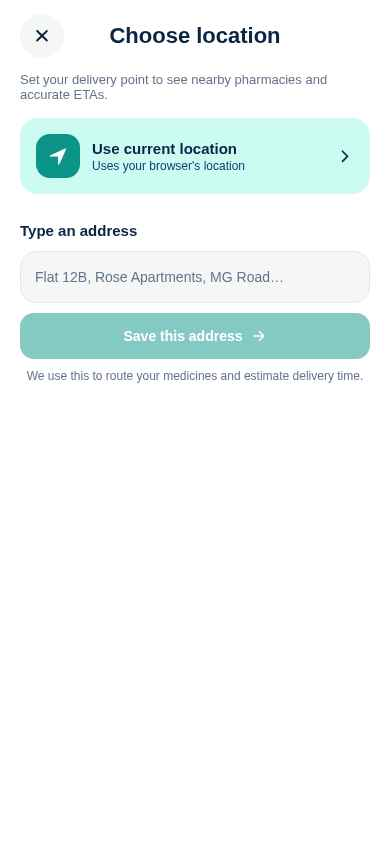
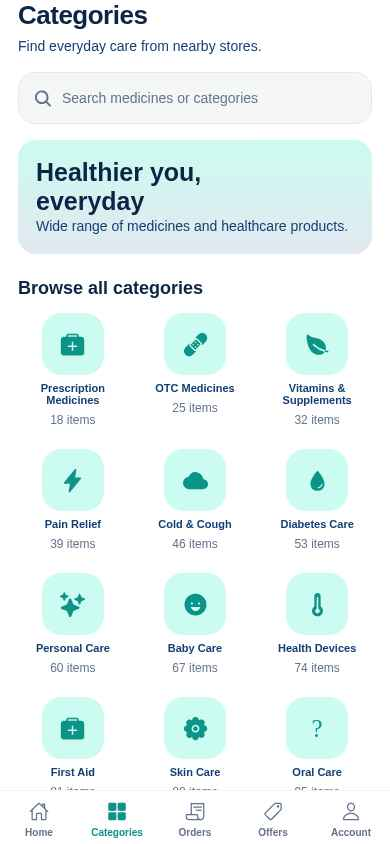
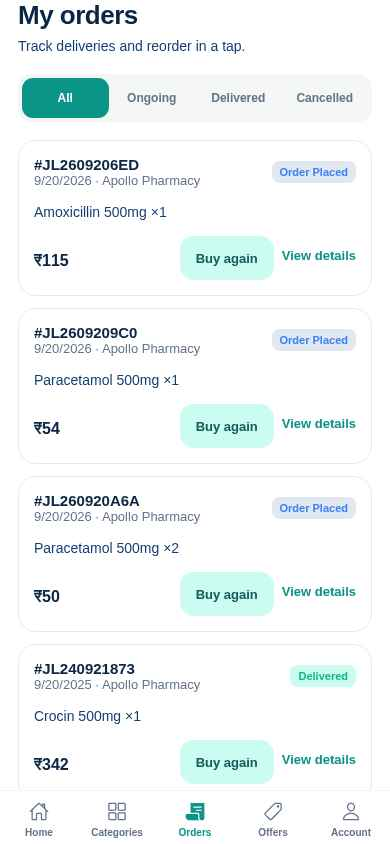
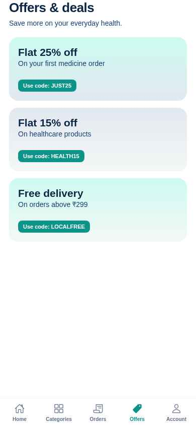
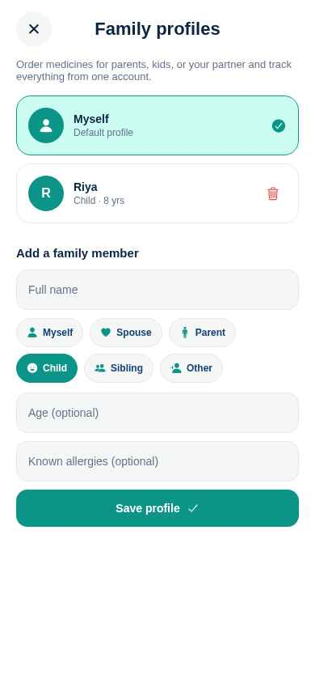
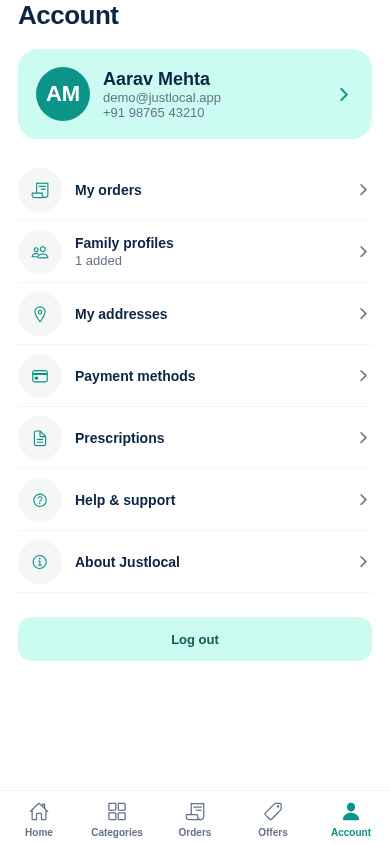

# Justlocal 💊

**Medicines closer to you** — a local-first mobile app to discover, order, and refill medicines from neighbourhood pharmacies.

Built with Expo (React Native) · FastAPI · MongoDB.

---

## Table of contents

- [Screenshots](#-screenshots)
- [Features](#-features)
- [Tech stack](#️-tech-stack)
- [Project structure](#-project-structure)
- [Getting started (local)](#-getting-started-local)
- [Environment variables](#-environment-variables)
- [API reference](#-api-reference)
- [Demo credentials](#-demo-credentials)
- [Third-party integrations](#-third-party-integrations)
- [Testing](#-testing)
- [Deployment](#-deployment)
- [Roadmap](#-roadmap)

---

## 📱 Screenshots

| Login | Home (with refill reminders) | Choose location |
| :---: | :---: | :---: |
|  |  |  |
| Playful capsule-pill logo, mint gradient, segmented Log in / Sign up, Google + Apple. | Dynamic location card, prescription upload, one-tap refill reminders. | Live GPS + reverse-geocode, manual entry, recents list. |

| Categories | Orders | Offers |
| :---: | :---: | :---: |
|  |  |  |
| 12 seeded categories, popular products, wellness hero. | Track deliveries, "Buy again", 5-step timeline. | Copy-code style promo cards. |

| Family profiles | Account |
| :---: | :---: |
|  |  |
| Add parents, kids, spouse. Order tagged with active profile. | Profile, family, addresses, payments, prescriptions. |

---

## ✨ Features

### Authentication
- **Email / phone + password** — JWT (HS256, 14-day) with bcrypt.
- **Sign in with Apple** — `expo-apple-authentication` + backend JWKS verification. iPhone-only.
- **Sign in with Google (Emergent-managed)** — hosted OAuth via `auth.emergentagent.com`; frontend captures `session_id`, backend exchanges it for a 7-day session token.
- Unified auth layer — one `current_user` dependency accepts both JWT and session tokens.
- Auto-login on relaunch through `expo-secure-store`.

### Shopping flow
- Browse **12 categories** (Prescription, OTC, Vitamins, Diabetes, First-aid, etc.).
- **Search** medicines and categories with debounced filtering.
- **Product details** modal with prescription warning, composition, local availability.
- **Cart** with quantity controls, delivery fee (free above ₹299, else ₹29).
- **Checkout** with delivery address, fulfilling pharmacy, payment method.

### Location Card (new)
- Tappable header opens the **Choose Location** modal.
- **Use current location** — `expo-location.getCurrentPositionAsync` + `reverseGeocodeAsync`.
- **Type an address** manually.
- **Saved recents** persisted in `AsyncStorage` (last 6).
- Location flows through to Home banner, cart checkout, and refill reorders.

### Family Profiles (new)
- Add family members with `relation` (self / spouse / parent / child / sibling / other), age, and allergies.
- Switch **active profile** from the Family modal — the order gets tagged with `for_profile_name` and appears on the order card.
- Fully server-backed (`GET/POST/DELETE /api/family`).

### Refill Reminders (new)
- Whenever a prescription-required medicine is ordered, a `refill` entry is created with `next_refill_at = created_at + 30 days`.
- The Home screen surfaces upcoming refills in a **priority card** with "Due today / Due in N days".
- **One-tap Reorder** creates a new order from the refill and rolls the reminder forward 30 days.

### Prescription upload
- `expo-image-picker` gallery selection.
- Multipart upload to `/api/prescriptions`; pharmacist-review status.

### Orders
- Tabs: All / Ongoing / Delivered / Cancelled.
- 5-step tracking timeline (Order Placed → Pharmacy Confirmed → Preparing → Out for Delivery → Delivered).
- Buy again & view details.

### Offers
- Three seeded promo cards with copy-code chips.

### Payments (scaffolded)
- **Razorpay** flow — `/api/payments/razorpay/{config,order,verify,webhook}`.
- On web, injects `checkout.razorpay.com/v1/checkout.js` and runs `window.Razorpay`.
- On native, requires a dev build (`react-native-razorpay`) — the app falls back to COD in Expo Go.
- Auto-disabled until real keys are added; COD works out-of-the-box.

---

## 🛠️ Tech stack

**Frontend**
- Expo SDK 57 (managed workflow) + Expo Router (file-based)
- React Native 0.86 (`react-native-web` for preview)
- `expo-apple-authentication`, `expo-web-browser`, `expo-linking`, `expo-secure-store`
- `expo-location`, `expo-image-picker`, `expo-linear-gradient`
- `@react-native-async-storage/async-storage`, `react-native-safe-area-context`, `react-native-keyboard-controller`

**Backend**
- FastAPI + Uvicorn
- Motor (async MongoDB driver)
- PyJWT (`[crypto]` for Apple RS256), bcrypt
- httpx (Apple JWKS + Emergent OAuth), razorpay
- python-multipart (prescription upload)

**Database**
- MongoDB (single database, seeded on startup)

---

## 📂 Project structure

```
app/
├── backend/
│   ├── server.py              # all FastAPI routes
│   ├── requirements.txt
│   ├── tests/                 # pytest suite (30/30 green)
│   └── .env                   # secrets (git-ignored)
├── frontend/
│   ├── app/
│   │   ├── _layout.tsx        # root layout (safe-area, error boundary, query client)
│   │   └── index.tsx          # single-route app (screens are in-file for simplicity)
│   ├── src/
│   │   ├── api.ts             # typed API client + shared types
│   │   ├── theme.ts           # design tokens + useTheme() / makeStyles()
│   │   ├── auth-helpers.ts    # Google (Emergent) + Apple sign-in helpers
│   │   ├── components/
│   │   │   ├── capsule-pill.tsx     # logo mark
│   │   │   ├── location-modal.tsx
│   │   │   └── family-modal.tsx
│   │   └── utils/storage/     # AsyncStorage + SecureStore wrapper
│   ├── app.json               # bundle IDs, permissions, plugins
│   └── package.json
├── docs/
│   └── screenshots/           # README screenshots
├── memory/
│   ├── PRD.md                 # full product spec
│   └── test_credentials.md    # seeded demo login
└── tests/
```

---

## 🚀 Getting started (local)

> Prereqs: Node ≥ 20, Yarn 1.x, Python 3.11+, MongoDB running locally (or Atlas).

### 1. Clone
```bash
git clone <your-repo-url> justlocal
cd justlocal
```

### 2. Backend
```bash
cd backend
python -m venv .venv && source .venv/bin/activate     # Windows: .venv\Scripts\activate
pip install -r requirements.txt

# create .env (see "Environment variables" below)
uvicorn server:app --host 0.0.0.0 --port 8001 --reload
```
Health check: <http://localhost:8001/api/> → `{"message":"Justlocal API is ready"}`

### 3. Frontend
```bash
cd ../frontend
yarn install

# point the app at the backend
echo 'EXPO_PUBLIC_BACKEND_URL=http://localhost:8001' > .env

yarn expo start
```
Scan the QR with Expo Go, or press `w` for web, `i` for iOS simulator, `a` for Android emulator.

---

## 🔐 Environment variables

### `backend/.env`
```env
MONGO_URL=mongodb://localhost:27017
DB_NAME=justlocal
JWT_SECRET=change-me-to-a-long-random-string

# Apple Sign-In — comma separated. First entry MUST match your iOS bundle id.
APPLE_AUDIENCES=com.example.justlocal,host.exp.Exponent

# Razorpay — leave as "placeholder" to disable online payments (app auto-falls back to COD)
RAZORPAY_KEY_ID=placeholder
RAZORPAY_KEY_SECRET=placeholder
RAZORPAY_WEBHOOK_SECRET=placeholder
```

### `frontend/.env`
```env
EXPO_PUBLIC_BACKEND_URL=http://localhost:8001
```

> ⚠️ Never commit `.env` files. Never expose secrets with `EXPO_PUBLIC_*` on the frontend — those are visible to end users.

---

## 📡 API reference

Base URL: `<host>/api`

### Auth
| Method | Path | Auth | Notes |
| :--- | :--- | :---: | :--- |
| POST | `/auth/register` | — | `{name, email, phone?, password}` |
| POST | `/auth/login` | — | `{identifier, password}` — identifier may be email or phone |
| POST | `/auth/apple` | — | `{identity_token, name?, email?}` |
| POST | `/auth/session` | — | `{session_id}` — exchanges Emergent OAuth session |
| GET | `/me` | ✅ | current user |
| POST | `/auth/logout` | ✅ | invalidates session tokens |

### Catalog
| Method | Path | Auth |
| :--- | :--- | :---: |
| GET | `/categories` | — |
| GET | `/medicines?category=&search=` | — |
| GET | `/pharmacies` | — |
| GET | `/offers` | — |

### Orders / prescriptions / addresses
| Method | Path | Auth |
| :--- | :--- | :---: |
| GET / POST | `/orders` | ✅ |
| POST | `/prescriptions` (multipart) | ✅ |
| POST | `/addresses` | ✅ |

### Family
| Method | Path | Auth |
| :--- | :--- | :---: |
| GET / POST | `/family` | ✅ |
| DELETE | `/family/{member_id}` | ✅ |

### Refills
| Method | Path | Auth |
| :--- | :--- | :---: |
| GET | `/refills` | ✅ |
| POST | `/refills/{refill_id}/reorder` | ✅ |

### Payments (Razorpay)
| Method | Path | Auth |
| :--- | :--- | :---: |
| GET | `/payments/razorpay/config` | — |
| POST | `/payments/razorpay/order` | ✅ |
| POST | `/payments/razorpay/verify` | ✅ |
| POST | `/payments/razorpay/webhook` | — (HMAC-signed) |

Auth header: `Authorization: Bearer <token>`.

---

## 🔑 Demo credentials

Seeded automatically on backend startup:

```
email:    demo@justlocal.app
password: Justlocal123!
phone:    +91 98765 43210
```

Comes with a saved Home address in Thane and a seeded Delivered order for the tracking demo.

---

## 🔌 Third-party integrations

| Integration | Status | Notes |
| :--- | :---: | :--- |
| Email/phone auth | ✅ | JWT + bcrypt |
| Apple Sign-In | ✅ | iOS device required (won't work in Expo Go). Add your bundle id to `APPLE_AUDIENCES`. |
| Google (Emergent-managed) | ✅ | Zero-config on Emergent; open-source clones need to point elsewhere. |
| Razorpay | ⚙️ scaffolded | Paste `RAZORPAY_KEY_ID` + `RAZORPAY_KEY_SECRET` (Test mode is fine). Web checkout works out-of-the-box; native needs `react-native-razorpay` + a dev build. |
| Emergent push notifications | ❌ opted out | Add later via the integration playbook; requires `google-services.json`. |

---

## 🧪 Testing

Backend has a pytest suite (`backend/tests/`). Run:
```bash
cd backend
pytest -q
# 30 passed
```

Frontend E2E was verified via Playwright against the preview URL. Screenshots in `/docs/screenshots/` are captured automatically.

---

## 🚀 Deployment

This project is designed for Emergent's managed deployment:
1. Test in **Preview**.
2. Click **Publish** → **Deploy**.
3. Add real secrets in **Deployment panel → Secrets** (they don't auto-sync from preview after first deploy).
4. Generate **iOS / Android builds** from the Publish panel.

For self-hosting, deploy the FastAPI backend behind HTTPS with a MongoDB instance (Atlas is easiest) and generate an EAS build for the Expo frontend pointing to your backend URL.

---

## 🛣️ Roadmap

- [ ] Real Razorpay Test-mode keys → live online payments
- [ ] `react-native-razorpay` native module for dev-client builds
- [ ] Emergent push notifications (order status updates)
- [ ] Multiple pharmacies at checkout with distinct delivery zones
- [ ] Real-time order status via WebSockets
- [ ] Voice search
- [ ] Auto-refill subscriptions

---

## 📄 License

Private project — all rights reserved. Update this section if you plan to open-source.
