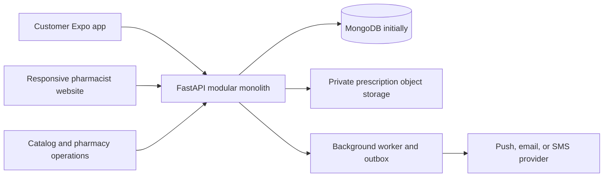

# Justlocal Architecture

This document separates the current implementation from the target architecture. The target supports a customer mobile app, a responsive pharmacist website, and one shared backend. It is a modular monolith, not a microservices system.

## Current State

- `frontend/` is the Expo customer app for iOS, Android, and web preview.
- `pharmacist-web/` is a responsive Vite client. It supports a clearly labeled sample preview and connects to the pharmacist API after verified sign-in.
- `backend/server.py` remains the FastAPI entry point and customer API; `backend/pharmacy_routes.py` owns the pharmacist and request/offer routes for now.
- MongoDB is the system of record. Customer requests route to up to five nearby verified pharmacies whose carry lists match; customers create orders by selecting an offer. Direct order and refill creation are disabled.
- The catalog and pharmacy data seeded by the backend are development data. They are not an authoritative government-approved medicines catalog.
- Prescription uploads are currently stored as base64 in MongoDB. This is a development implementation; move files to private object storage with retention controls before production.
- Dispatch is synchronous and customer offers are polled. A background worker, push notifications, dedicated admin interface, and official India medicine source are not implemented yet.

## Target System



The apps are separate clients, not separate backends. The backend owns identity, pharmacy permissions, catalog truth, matching, offer selection, and order state. Client-side hiding is not an authorization boundary.

## Repository Boundaries

Keep existing paths stable while extracting backend modules incrementally:

```text
backend/
  server.py                 # temporary compatibility entry point: server:app
  pharmacy_routes.py        # current pharmacist and marketplace routes
  app/
    main.py                 # FastAPI application and middleware
    api/v1/                 # HTTP routers and request/response schemas
    core/                   # settings, authentication, authorization
    domains/
      catalog/
      pharmacies/
      requests/
      offers/
      orders/
      prescriptions/
      payments/
    database/               # Mongo clients, indexes, repositories
    workers/                 # dispatch and notification jobs
  tests/

frontend/                   # existing customer Expo app
pharmacist-web/             # responsive pharmacist website and sample preview
docs/
```

Each domain owns its validation and business rules. API routers translate HTTP requests into domain operations; database queries should not be duplicated across route handlers. Keep the current `uvicorn server:app` command working during the migration, then update it only after deployment configuration is ready.

The pharmacist website is desktop-friendly for pharmacy-counter work and responsive on tablets and phones. It uses the shared `/api` backend after sign-in. Do not duplicate matching, pricing, state transitions, or authorization rules in either client.

## Core Data

- **CatalogProduct**: normalized product identity, ingredients, strength, dosage form, pack, manufacturer, prescription classification, source, source reference, and verification date. Only products with verified provenance may be labeled government-approved.
- **Pharmacy**: pharmacy profile, verified license status, service location, operating state, and authorized pharmacist memberships.
- **PharmacyCarryListing**: pharmacy ID, catalog product ID, whether the pharmacy carries it, pharmacy-set price, and last-updated time. Do not store or expose on-hand quantities.
- **MedicineRequest**: customer, requested catalog products and quantities, delivery area, prescription reference, consent, expiry, and overall workflow state.
- **PharmacyRequest**: one assignment of a request to one pharmacy, with its own response state and timestamps.
- **Offer**: pharmacy response for that request, including confirmed availability (available, partial, unavailable), price, delivery estimate, and expiry. No stock count is required.
- **PrescriptionReview**: assigned pharmacist, decision, reason or clarification request, timestamp, and audit metadata. Review is performed by a qualified human.
- **Order**: created only after the customer selects a valid offer; it references the selected offer and records the price snapshot accepted by the customer.

## Request Lifecycle

1. The customer creates a medicine request and consents to sharing the prescription with participating pharmacies when needed.
2. The backend finds up to five eligible, verified pharmacies near the delivery location whose carry lists match the requested products. If fewer qualify, it reports the actual number; it must not imply that five pharmacies were contacted.
3. Each pharmacy independently checks physical stock and, when required, reviews the prescription. Carry-list membership is only a routing hint, not a stock guarantee.
4. The pharmacist submits an offer, partial offer, unavailability, or decline. The customer sees responses as they arrive and can compare the returned prices and delivery estimates.
5. The customer selects one unexpired offer. The backend permits only one selection, creates the order from the accepted price snapshot, and closes the other pharmacy assignments.

Suggested states:

```text
Request: dispatching -> collecting_offers -> selecting_offer -> order_placed
                                   -> no_pharmacies | expired

PharmacyRequest: invited -> reviewing -> offered | unavailable
                          -> needs_clarification | not_approved | closed | expired
```

Enforce state changes and authorization in the backend. Make offer submission and selection idempotent so retries cannot create duplicate offers or orders. Decide request timeouts and customer cancellation behavior before launch.

## API And Background Work

The implemented routes currently use `/api`; version them deliberately before a public production release. The main request/response boundaries are:

- `POST /medicine-requests` creates a request and starts dispatch.
- `GET /medicine-requests` and `GET /medicine-requests/{request_id}` return customer-visible status and offers.
- `GET /pharmacist/requests` returns only assignments for the signed-in pharmacist's verified pharmacy.
- `GET /pharmacist/requests/{request_id}/prescription` retrieves the assigned prescription after consent and logs access.
- `POST /pharmacist/requests/{request_id}/prescription-review` records the human pharmacist decision.
- `POST /pharmacist/requests/{request_id}/offer` submits that pharmacy's response.
- `POST /medicine-requests/{request_id}/select-offer` selects an offer and creates the order.
- `GET/POST/PATCH /pharmacist/carry-list` searches the catalog and manages carried products and prices.

The current implementation persists up to five assignments and polls every six seconds in the customer app. Add an outbox-backed worker before relying on external notifications or higher-volume dispatch.

## Security And Privacy

- Use separate customer and pharmacist roles, with pharmacy-scoped authorization on every pharmacist endpoint.
- Require manual pharmacy and pharmacist verification before a pharmacy can receive live customer requests.
- Do not expose prescription images through public URLs. Store them privately, grant narrowly scoped/time-limited access, record access, and honor customer consent.
- The current prototype returns an assigned image as base64 behind pharmacist authorization. Replace this with short-lived private object-storage access before production.
- `PHARMACY_ADMIN_TOKEN` protects the initial manual verification endpoints. Replace the shared admin token with role-based admin accounts and auditable review tools before production.
- Do not put prescription contents, access tokens, or credentials in logs. Store production secrets in the deployment secret manager; never use frontend `EXPO_PUBLIC_*` variables for secrets.
- Keep audit events for pharmacy verification, prescription review, offer changes, selection, and order state transitions.
- Treat seeded medicines and pharmacies as local development fixtures, not production records or regulatory evidence.

## Data And Reliability

Keep MongoDB for the initial architecture to avoid an unnecessary migration. Add schema validation and indexes for unique IDs, request state/expiry, pharmacy carry-list lookups, and `2dsphere` pharmacy locations. Verify the production MongoDB topology supports the atomicity required for selecting one offer and creating its order. Re-evaluate PostgreSQL/PostGIS before production if cross-entity constraints and transactional workflows become difficult to enforce safely.

Keep prescription files in private object storage rather than base64 fields in MongoDB as the workflow matures. Use an outbox-backed worker for dispatch and notifications; add a managed queue only when retry volume or throughput calls for it. Do not split the backend into microservices until independently scaling or deploying a domain solves a measured problem.

## Quality Gates

- Unit tests for matching, pricing validation, authorization, and state transitions.
- API integration tests for customer and pharmacist permissions, request fan-out, duplicate retries, expired offers, and selecting exactly one offer.
- End-to-end test for customer request -> pharmacy response -> customer selection -> order creation.
- Frontend lint, type checking, and responsive browser tests for the pharmacist site; preserve the existing customer-app checks.
- Structured logs and error monitoring with request IDs. Never log prescription data or secrets.

## Delivery Sequence

1. Add verified pharmacy identity and pharmacy-scoped authorization.
2. Add the provenance-backed shared catalog and pharmacy carry-list/price management.
3. Add customer requests, nearest-pharmacy dispatch, and pharmacist responses.
4. Add offer comparison and selection, then create the existing order from the selected offer.
5. Add production prescription storage/access controls, notification retries, monitoring, and operational tooling.

Do not label the demo catalog government-approved until an authoritative India-specific source and its allowed usage have been confirmed.